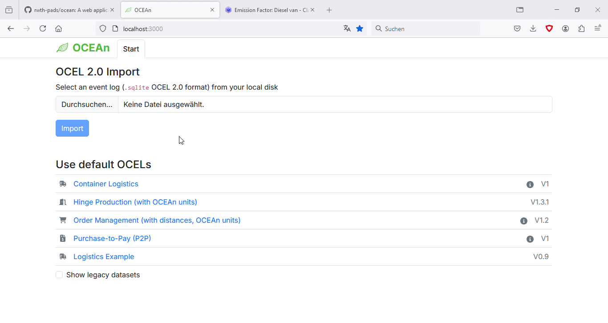

# OCEAn

[](https://www.python.org/downloads/release/python-3100/)
[](https://fastapi.tiangolo.com/)
[]()
[](https://processintelligence.solutions/pm4py)
[](https://www.openapis.org/)
[](https://github.com/psf/black)

[](https://nodejs.org/en)
[](https://www.typescriptlang.org/)
[](https://react.dev/)
[](https://nextjs.org/)
[](https://react-bootstrap.netlify.app/)



In the above demo video, the [Order Management OCEL](https://zenodo.org/records/8337464), enriched with transport distances, is imported and its transport emissions analyzed.

## Description
Welcome to **OCEAn** *(**O**bject-**c**entric **E**mission **An**alysis)*, a web app for carbon emission analysis of [object-centric event logs \(OCELs\)](https://ocel-standard.org/). OCEAn's main features are
- Importing OCELs (OCEL 2.0 `sqlite` format) and enriching them by event-level emission data based on user-defined rules
- Allocating emissions from events to objects
- Visualizing and exporting the emission data

The project consists of
- A backend running on Python 3.10, mostly using FastAPI, pandas, pm4py, pydantic and pint,
- A frontend based on React / Next.js, using React Bootstrap elements.

## Installation

### via Docker

Docker support will be added shortly.

### Default
**Backend**: using `pypoetry`, when inside `/src/backend`, dependencies can be installed with
```console
poetry install
```

**Frontend**: using `npm`, when inside `/src/frontend`, dependencies can be installed with
```console
npm install
```

## Usage

Backend and frontend are started using the following two commands in separate terminals:

```console
python main.py
npm run dev
```

After starting, the app can be accessed at http://localhost:3000.
To get started, try loading one of the event logs listed on the start page.


## Repository structure

- `src/backend`:
  - `api`: FastAPI config, API models
  - `data`: MOVE
  - `drafts`: MOVE
  - `emissions`: Emission model, rules, allocation
  - `ocel`: OCEL 2.0 Wrapper class, attributes & utils
  - `units`: Quantity representations (with `pint`), and conversion to climatiq API
  - `util`: Misc util functions
  - `visualization`: Mostly used for evaluation (+OCPN rendering)
- `src/frontend`:
  - `components`: React components
  - `pages`: React page components & main app
  - `public`: Images
  - `src`: reusable TypeScript functions & type definitions
    - `src/api/generated`: API handlers & types generated by `openapi-ts`
- `thesis`: The thesis project, including the PDF, and the complete LaTeX project.
- `data`:
  - `event_logs`: Example OCELs
  - `preprocessing`: TODO
  - `evaluation`: Notebooks and output files for evaluation (see Chapter 5)
  - `README.ms`: TODO

## Details

### App state

User inputs made in the frontend are automatically passed to the API and saved in the `Session` object.
This way, sessions are preserved when refreshing.
Sessions are identified via a UUID and saved in the browser's `localStorage`.

The inputs (called `AppState`) include
- object type colors
- object type classes (Handling units / resources)
- attribute units (represented like `{ "name": "meter/second", "symbol": "m/s", "dim": {"[length]": 1, "[time]": -1}}`)
- list of attributes representing emissions
- emission rules
- object allocation config

When exporting the OCEL to an `sqlite` file,
the app state is saved to a new table called `ocean_app_state` as key-value pairs.
Each component of the state is saved in a single row, serialized to JSON.

### API

FastAPI generates an `openapi.json` file following the OpenAPI standard.
When the backend is running, API docs can be accessed at http://localhost:3000/docs/rapidoc.

All types passed along the API are defined in the backend using `pydantic` models.
`pydantic` handles validation and serialization of these data structures.
API routes defined in `src/backend/index.py` are automatically passed a current `Session` and `OCELWrapper` instance.
The current OCEL is further used in custom validators of `ModelWithOcel` subclasses.
This way, when sending an emission rule it is automatically checked whether an attribute name that is used exists in the OCEL.
When using only parts of the implementation, run
```python
from api.model.with_ocel import ocel_ctx
ocel_ctx.set(ocel)
```
to make the validators access a current OCEL instance via a context variable.

The frontend accesses the API via code generated by the `openapi-ts` package.
When making changes to the backend, run `npx openapi-ts` in `src/frontend` with the backend running to re-generate.

## Authors and acknowledgment
Author: Raimund Hensen

This project has been developed for my master's thesis at the [Chair of Process and Data Science \(PADS\)](https://www.pads.rwth-aachen.de) at RWTH Aachen University under the supervision of Nina Graves and Prof. Wil van der Aalst.


## License

see [license](LICENSE) document.
